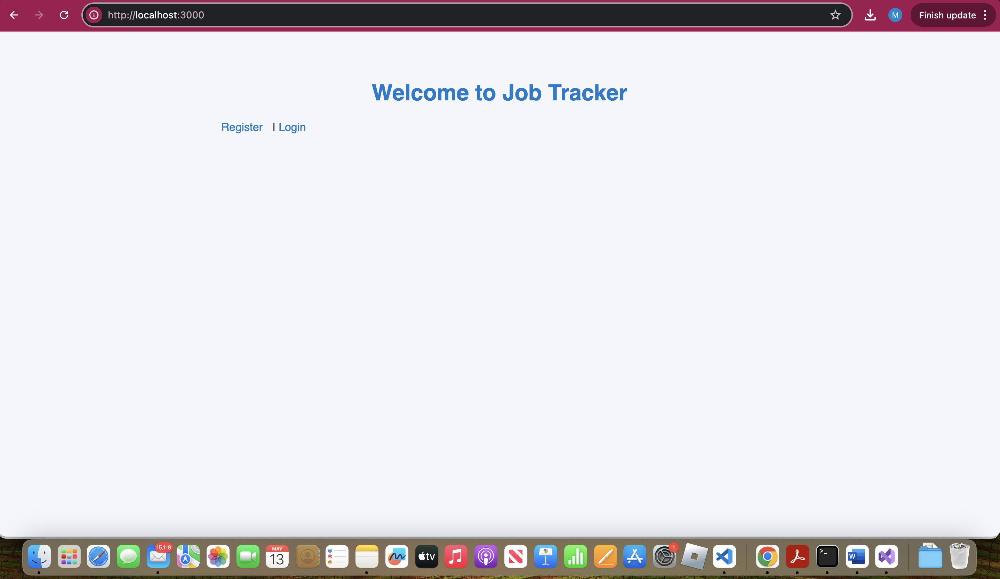
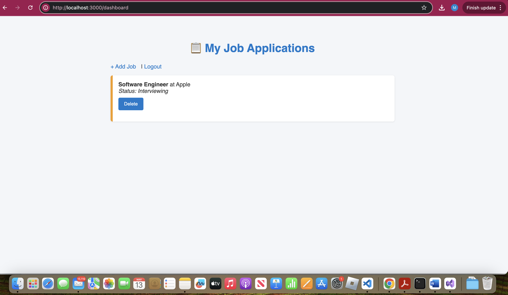

# 🧾 Job Tracker App


A full-stack job tracking application where users can register, log in, and manage a personalized list of job applications.

---

## ✨ Features

- ✅ User Authentication (Login/Register)
- ✅ Add, view, and delete job applications
- ✅ Status tracking: Applied, Interviewing, Offer, Rejected
- ✅ Color-coded UI based on job status
- ✅ Session-based access control
- ✅ MongoDB storage with Mongoose

---

## 📸 Screenshots

> _Replace these image links with your actual screenshots_

### 📋 Dashboard View


### ➕ Add Job Form


---

## 🛠 Tech Stack

| Layer       | Technology            |
|-------------|------------------------|
| Backend     | Node.js, Express.js    |
| Frontend    | HTML, CSS (custom)     |
| Database    | MongoDB + Mongoose     |
| Auth        | express-session, bcryptjs |
| Templating  | EJS                    |

---

## 🚀 How to Run Locally

```bash
git clone https://github.com/John27052001/job-tracker-app.git
cd job-tracker-app
npm install
node server.js
```

Visit: [http://localhost:3000](http://localhost:3000)

---

## 📂 Folder Structure

```
job-tracker-app/
├── models/
├── routes/
├── views/
├── public/
├── server.js
└── package.json
```

---

## 🙋‍♀️ Author

**Megha John**  
GitHub: [@John27052001](https://github.com/John27052001)  
LinkedIn: [Add your LinkedIn link here]

---

## 📝 License

This project is licensed under the MIT License.
